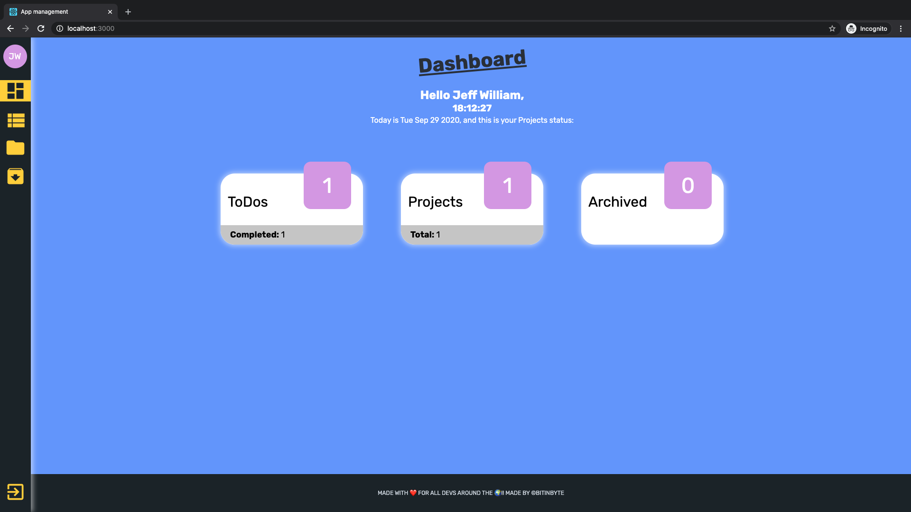
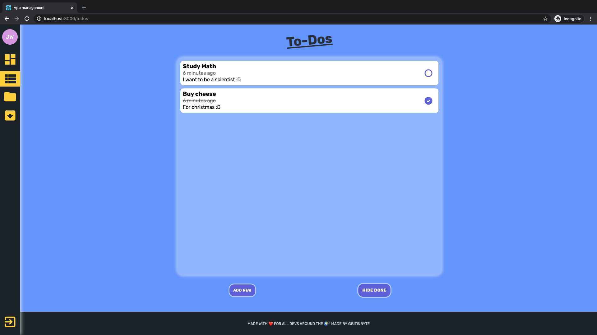
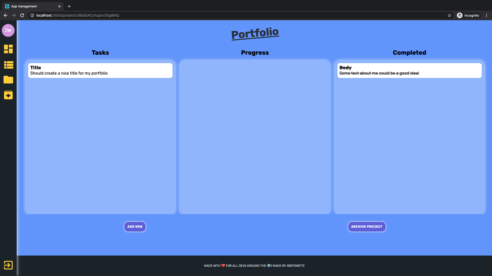

# Project management App

## [Check it here](https://www.jopecodes.com/)

Dashboard!

ToDos

Project View

## Getting Started

Bigger project I've ever made!

## Specifications

I wanted to made something big that I could improve and learn some complex concepts such that login and register and a bit of backend. This project is the result of that.

## Built With

- React
- Firebase
- SASS (modules)
- Prop-types
- React-spring
- Formik

## Contributing

Feel free to download it and improve it. If you want just give a pull request with your changes and let me know what can be improved. Many thanks :D

## Pages

- [GitHub Page](https://github.com/BitInByte)
- [Instagram](https://www.instagram.com/bitinbyte/)
- [Twitter](https://twitter.com/BitInByte2)
- [Portfolio](https://www.jopecodes.com)

## Authors

**BitInByte** - Development student and tech enthusiastic
